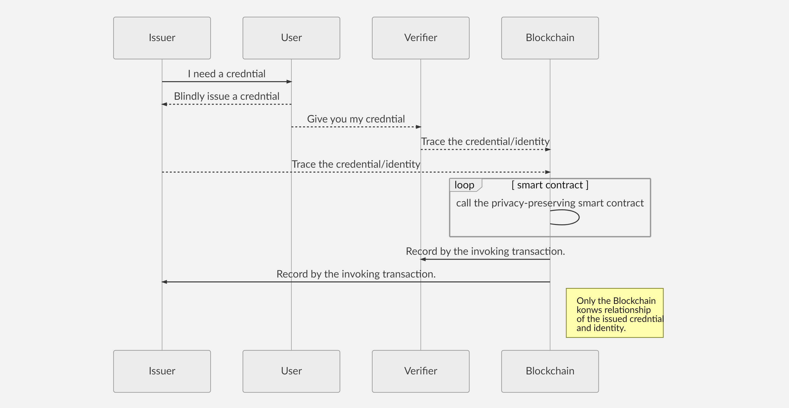
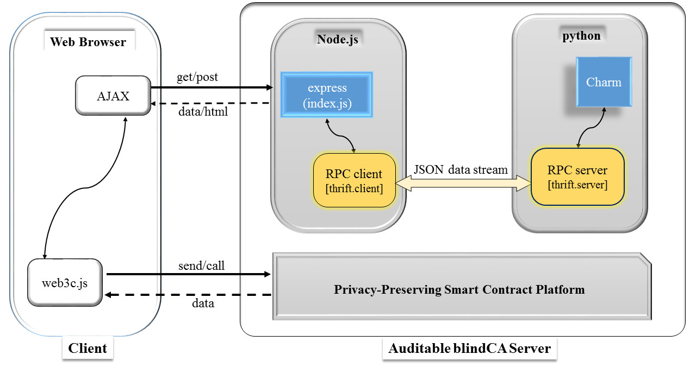
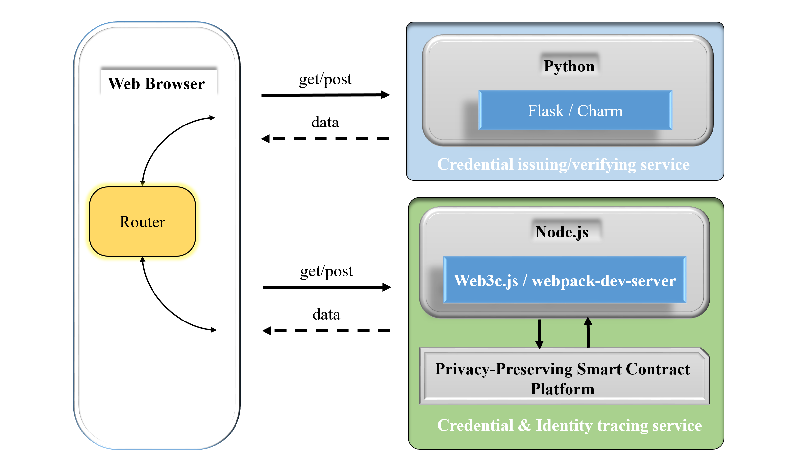
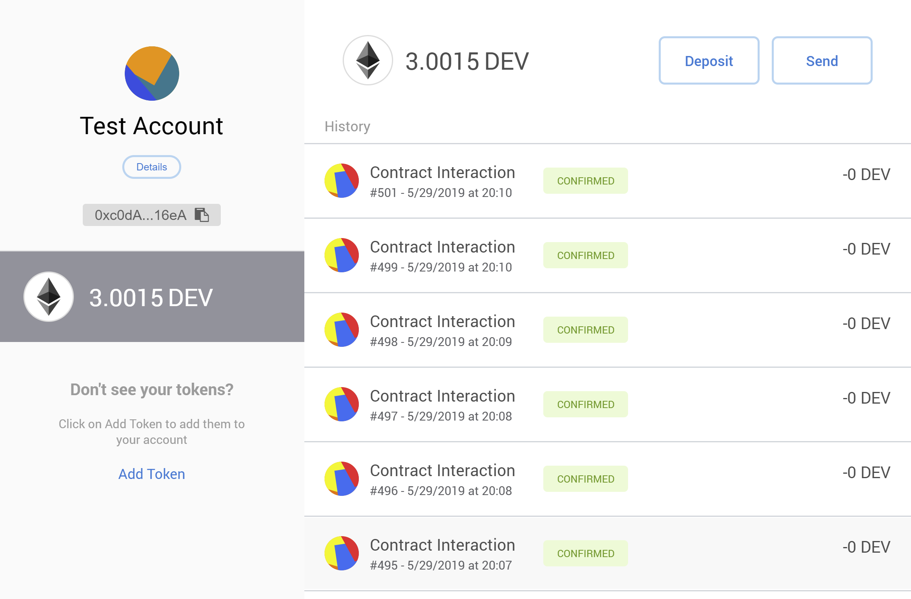
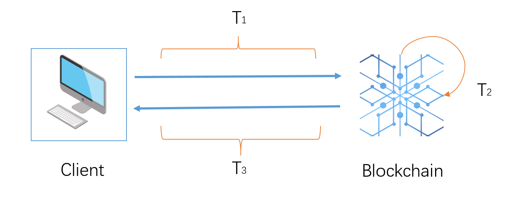

# Auditable Credential Based on Privacy-Preserving Smart Contract


| <a href="#overview"> Overview </a> | <a href="#workflow">Workflow</a> | <a href="#architecture">Architecture</a> | <a href="#architecture">Functionality</a> | <a href="#evaluation">Evaluation</a> | <a href="#proofs">Proofs</a> | <a href="#resource">Resource</a> |

[](https://github.com/sindresorhus/awesome)

## Overview
This project is a privacy-focused blind credential framework powered by blockchain technology;  in particular, it employs [Oasis Env](https://www.oasislabs.com/) as the privacy-preserving smart contract execution platform.  It allows an issuer to release a credential blindly and make the verifier to reveal this blindness by interacting with the privacy-preserving smart contract. Since the calling progress with the privacy-preserving smart contract is transparent, the project makes the blindness showing traceable.


## Workflow

A user firstly interacts with a privacy-preserving smart contract through a secure communication channel to negotiate the parameters; an issuer blindly issues a credential to the user; the user shows the issued credential and the verifier confirms the credential; the corresponding entities such as issuer and verifier invoke the blockchain bearing an auditable transaction to reveal the blindness.

<!--  -->

<div align="center">

</div>


This process is implemented as five main functionalities in our system: parameter preparation, credential issuing, credential verifying, identity tracing and credential tracing. Among them, the protocols of identity tracing and credential tracing are executed on blockchain, while the protocols of credential issuing and credential verifying are executed locally(independent of blockchain). The details are shown as follows:

|    Functionality |Description |Remark                         |
|----------------|-------------------------------|-----------------------------|
|Parameter preparation|Preparing the parameters such the p q and the order of the Group.| **on-line blockchain**         |
|Credential issuing |Blindly issuing credentials without knowing users' identity. |off-line blockchain|
|Credential verifying|Verifying credentials by the Verifier|off-line blockchain|
|Identity tracing|Tracing identity by giving the credential.|**on-line blockchain**|
|Credential tracing|Tracing credential by giving the credential identity.|**on-line blockchain**|


## Architecture

Two architectures are given in our implementation: the integration server and micro service. 

### Integration server 

An integration server [2] is a type of server that enables the integration and interaction of different operating systems, application and services within an enterprise IT environment. It enables applications and services to communicate with each other, regardless of their underlying platform. It eliminates compatibility and interoperability issues between different platforms.

As it is shown below, the server is built with [express](https://github.com/expressjs/express), which is one of the most popular frameworks for web developers.
In terms of cryptosystems, a powerful framework called [charm](https://github.com/JHUISI/charm) is employed.
To share data between these two different modules, we utilize [thrift](https://github.com/apache/thrift) (a lightweight RPC framework) for inter data communication.

<!---->

<div align="center">

</div>

We suggest using docker to deploy the integration server.

```
docker pull aowatchsea/blindca
docker run -t -i -p 443:8080 aowatchsea/blindca
start.sh
```


### Micro service

Microservice [2] architecture allows the system to be implemented in different programming languages and be deployed independently. As it is shown in the following illustration, the microservice architecture is represented as two independent services collaborating as one system: Credential issuing/verifying service and Credential tracing service. Credential issuing/verifying service is implemented by Python, while credential tracing service is implemented by NodeJs.

<div align="center">

</div>

## Evaluation

### Performance testing
This table shows the average testing time (in seconds) for each procedure (**1000 rounds**) under different security parameters (Elliptic Curves 192, Elliptic Curves 256, Integers Group 256, Integers Group 1024). 

> All experiments are conducted on a Dell precision 3630 tower with 16GB of RAM and one 3.7GHz six core i7-8700K processors running Ubuntu 18.04.

For more details, we refer the reader to [Elliptic_Curves_192_result](./test/result/ECC_192_result.csv), [Elliptic_Curves_256_result](./test/result/ECC_256_result.csv), [Integers_Group_256_result](./test/result/DL_256_result.csv), [Integers_Group_1024_result](./test/result/DL_1024_result.csv).

||Parameter preparation|Credential issuing|Credential verifying |Identity tracing|Credential tracing| 
|:-:|:-:|:-:|:-:|:-:|:-:| 
|Elliptic Curves 192|0.00052|0.00454|0.00141|0.00391|0.00216| 
|Elliptic Curves 256|0.00084|0.00740|0.00232|0.00455|0.00306| 
|Integers Group 256 |0.02839|0.000245|0.00008|0.00041|0.00038|
|Integers Group 1024|2.28698|0.006368|0.00296|&times;|&times;|

We use a simulation-based testing approach to test the code execution in a smart contract. We first simulate the network request and response time NT1 with calling an empty function in the smart contract. Then, we simulate the network request and response time NT2 with calling a function that covers the code. Lastly, the code execution time is represented as NT2 getting rid of NT1. The below picture shows the part of the test record according to our new testing method.

<div align="center">

</div>

### Latency testing

Latency is an essential consideration for adopting a blockchain based system - too much latency may discourage the user from employing such kind of system. In our prototype,  the latency time includes blockchain confirming time T2 and the network request time T1 and response time T3 which is shown as follows:

<div align="center">

</div>

<div align="center"> <a href="https://www.codecogs.com/eqnedit.php?latex=T_{total}&space;=&space;T_{1}&space;&plus;&space;T_{2}&space;&plus;&space;T_{3}" target="_blank"></a> </div>
 

> Latency testing of credential issuing and credential verifying are not covered in the table since these operations are executed independently from blockchain.

||Contract deployment |Parameter preparation |Identity tracing|Credential tracing| 
|:-:|:-:|:-:|:-:|:-:|
|Elliptic Curves 192|14.104|12.346|16.678|16.052| 
|Elliptic Curves 256|15.213|14.781|17.538|18.905| 
|Integers Group 256|12.563|11.327|12.870|15.659|
|Integers Group 1024|13.263|&times;|&times;|&times;| 

### Cost testing
Our project is based on [Oasis Env](https://www.oasislabs.com/). In this stage their coin is used at no costs. However, the gas of the related operations is still evaluated to prove that this cost is acceptable even if it will have intrinsic value in the future.

> Similar to the above latency testing, the cost testing of credential issuing and credential verifying are not covered in the table since these operations are executed independently from  blockchain.

||Contract deployment |Parameter preparation |Identity tracing|Credential tracing| 
|:-:|:-:|:-:|:-:|:-:|
|Elliptic Curves 192|0.000264|0.00020|0.002930|0.002979| 
|Elliptic Curves 256|0.000264|0.00020|0.003889|0.003902| 
|Integers Group 256|0.000157|0.000139|0.000060|0.000051| 
|Integers Group 1024|0.000157|&times;|&times;|&times;|


## Proofs

Game based Cryptographic Proofs


## Resource

1. Project page [auditable-credential-webpage](https://auditable-credential.github.io/auditable-credential-webpage/)
2. Documentation [auditable-credential-documentation](https://typex-1.github.io/auditable-credential-documentation/)
3. Performance testing records
   * Elliptic Curves version [Elliptic_Curves_192_result](./test/result/ECC_192_result.csv), [Elliptic_Curves_256_result](./test/result/ECC_256_result.csv).
   * Integers Group version [Integers_Group_256_result](./test/result/DL_256_result.csv), [Integers_Group_1024_result](./test/result/DL_1024_result.csv).
4. Delay & Cost testing records  [transactions in Oasis Devnet](<https://blockexplorer.oasiscloud.io/address/0xc0da132a37c52f7c244e5e02ca79e4f3c8d116ea/transactions>)

## Reference

[1] <https://searchcio.techtarget.com/definition/integration-server>  
[2] <https://microservices.io/>


   
